# 🏗️ JXCT Soil Sensor – Architecture Overview (H2-2025)

> Version: v2.7.0 (production) – generated 2025-06-20

## 1. Layered view
```
┌─────────────────────────────┐
│           Web UI            │  (HTML/JS/CSS in PROGMEM)
├────────────▲────────────────┤
│        REST API Layer       │  (routes_*.cpp)
├────────────▲────────────────┤
│     Service/Managers        │  Wi-Fi, MQTT, OTA, FS
├────────────▲────────────────┤
│       Core / Domain         │  SensorCompensator, RecommendationEngine
├────────────▲────────────────┤
│   Hardware Abstraction      │  ISensor, ModbusSensor, FakeSensor
├────────────▲────────────────┤
│         HAL / SDK           │  ESP32-Arduino Core, FreeRTOS
└─────────────────────────────┘
```

• **Uni-directional flow** – data moves upward, commands downward.  
• `ISensor` hides Modbus and allows unit-тестирование через `FakeSensor`.

## 2. Runtime components
| Component | Task | Stack | CoreID |
|-----------|------|-------|--------|
| SensorTask | Poll HW, cache JSON | 4 KB | 0 |
| WebServerTask | Serve HTTP/WebSocket | 8 KB | 1 |
| MqttTask | Publish data / recv cmd | 6 KB | 1 |
| Watchdog | HW reset guard | 2 KB | 0 |

## 3. Build & CI pipeline
1. `lint` – clang-format, markdown-lint.  
2. `analyze` – `cppcheck --enable=all`, `clang-tidy`.  
3. `test` – Unity (on ESP32) + native (PC).  
4. `package` – produce `jxct_{{version}}.bin` + `.spiffs`.  
5. `release` – upload artefacts, create GitHub Release.

## 4. Data flow (sensor → MQTT)

```mermaid
sequenceDiagram
    participant SoilSensor
    participant SensorTask
    participant SensorCompensator
    participant MqttTask
    SoilSensor->>SensorTask: readRegisters()
    SensorTask->>SensorCompensator: correct(T,θ,pH,EC,NPK)
    SensorCompensator-->>SensorTask: compensated JSON
    SensorTask-->>MqttTask: push(queue)
    MqttTask->>MQTT Broker: publish(json)
```


## 5. Dependencies
| Domain | Library | Min ver |
|--------|---------|---------|
| MQTT   | PubSubClient | 2.8 |
| JSON   | ArduinoJson  | 6.21 |
| Modbus | ModbusMaster | 2.0 |

## 6. Glossary
* **θ** – volumetric water content.  
* **ECe** – electrical conductivity of saturated paste.  
* **HAL** – hardware abstraction layer.

---
Maintainer: **System Architect** – _update every minor release_. 