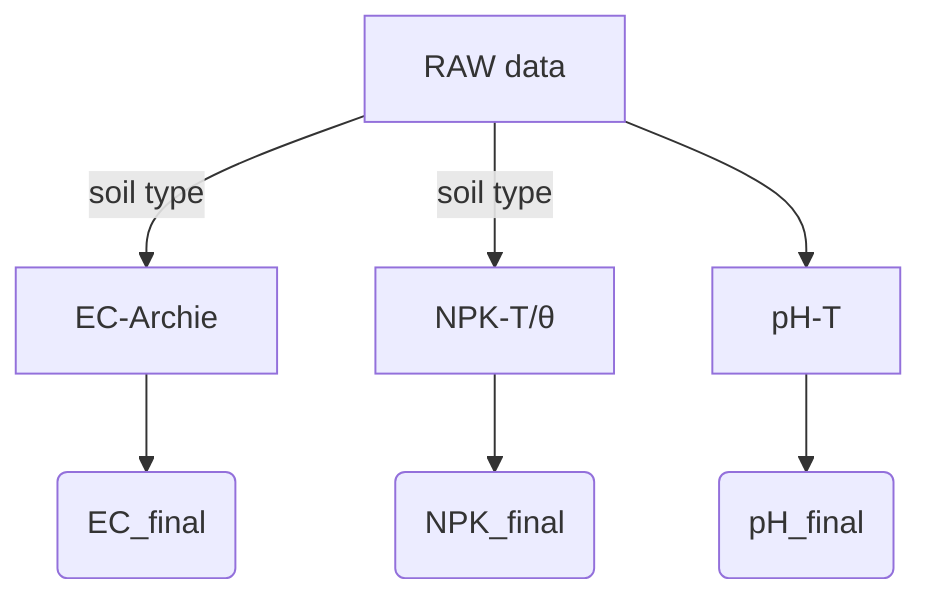

# Научно обоснованная ревизия системы компенсации и рекомендаций (v3.0)

> Издание заменяет предыдущий `AGRO_RECOMMENDATIONS.md`. Ключевая цель — обеспечить согласованность с обновлённым руководством по компенсации v2.6.0 и устранить эмпирические допущения, не подтверждённые литературой.

---

## 1. Алгоритмы компенсации

### 1.1 Физически корректные модели

#### EC – модель Арчи
```python
def correct_ec(ec_25, θ, soil):
    """Пересчёт EC (25 °C) к стандартной влажности с учётом типа почвы.
    ec_25 – EC, скорректированная по температуре, µS/cm
    θ – текущая влажность почвы, %
    soil – 'sand' | 'loam' | 'clay' | 'peat'"""
    porosity = {'sand':0.35,'loam':0.45,'clay':0.50,'peat':0.85}
    m        = {'sand':1.3 ,'loam':1.8 ,'clay':2.2 ,'peat':1.9}
    F = porosity[soil] ** -m[soil]           # formation-factor
    return ec_25 * (θ/100) * F
```

#### pH – только температурная компенсация
```python
pH_final = pH_raw - 0.003 * (T - 25)  # 0.059/20≈0.003
```

#### NPK – T- и θ-зависимость + тип почвы
```python
TEMP_K = {
  'sand': {'N':0.0041,'P':0.0053,'K':0.0032},
  'loam': {'N':0.0038,'P':0.0049,'K':0.0029},
  'clay': {'N':0.0032,'P':0.0042,'K':0.0024},
  'peat': {'N':0.0028,'P':0.0035,'K':0.0018}
}
HUM_K = {
  'N': lambda θ: 1.8 - 0.024*θ,
  'P': lambda θ: 1.6 - 0.018*θ,
  'K': lambda θ: 1.9 - 0.021*θ
}

def correct_npk(raw, T, θ, el, soil):
    return raw * (1 - TEMP_K[soil][el]*(T-25)) * HUM_K[el](θ)
```

### 1.3 Архитектура


---

## 2. Рекомендации – динамические и адаптивные

### 2.1 Оптимумы, зависящие от стадии и температуры
```jsonc
{
  "tomato": {
    "fruiting": {
      "npk": {
        "N": {"min":80, "optimal":"110 + 0.2*(T-22)", "max":140}
      }
    }
  }
}
```

### 2.2 Почвенно-адаптивные поправки
```python
def soil_adjustment(param, v, soil):
    rules={
      'sand': {'moisture':0.85,'N':1.15},
      'clay': {'moisture':1.25,'P':0.85}
    }
    factor=rules.get(soil,{}).get(param,1.0)
    return v*factor
```

### 2.3 Ограничения достоверности
| Параметр | Условие | Действие |
|----------|---------|----------|
| pH | 20 % < θ < 60 % | иначе warning E201 |
| NPK | θ ≥ 25 % | иначе измерения недостоверны |
| EC | EC_raw > 3000 µS/см | риски засоления |

---

## 3. Протоколы калибровки

### 3.1 EC
* 3-точечная: 1.413 → 12.88 → 80 mS/см.  
* Температурная коррекция: `EC25 = EC_T / (1+0.019·ΔT)`.

### 3.2 pH
* Буферы 4.01 и 7.01.  
* ΔpH = 0.003 · (25 − T).

---

## 4. Система предупреждений
* **EC > 3000 µS/см** — «Риск засоления».  
* **θ < 20 %** — «Недостоверно для NPK».  
* **pH вне 3–9** — «За пределами датчика».

---

## 5. План внедрения
1. Переписать компенсационные функции (готово в `sensor_compensation.cpp`).
2. Пересчитать оптимумы культур с динамическими формулами.
3. Внедрить soil-adaptive поправки и предупреждения в API/UI.

---

## 6. Научные источники
1. Archie G.E. (1942) *Electrical resistivity log as an aid in determining some reservoir characteristics*.
2. USDA Handbook 60 *Diagnosis and Improvement of Saline and Alkali Soils*.
3. Allen R.G. et al. (1998) *FAO Irrigation Paper 56*.
4. SSSA Journal (2021) *Temperature effects on nutrient availability*.

---

© JXCT, 2025 
# База данных сельскохозяйственных культур

## Структура данных

Каждая культура описывается следующими параметрами:
```json
{
  "name": "Название культуры",
  "type": "vegetable|fruit|berry|grain|herb",
  "environment_type": "outdoor|greenhouse|both",
  "soil_types": ["sand", "loam", "clay", "peat"],
  "stages": ["germination", "vegetative", "flowering", "fruiting"],
  "temperature": {
    "min": 10,
    "optimal": 18,
    "max": 30,
    "stages": {
      "germination": {"min": 12, "optimal": 20, "max": 25},
      "vegetative": {"min": 15, "optimal": 22, "max": 28},
      "flowering": {"min": 18, "optimal": 24, "max": 30},
      "fruiting": {"min": 16, "optimal": 23, "max": 28}
    }
  },
  "moisture": {
    "min_ppv": 60,
    "optimal_ppv": 70,
    "max_ppv": 80,
    "soil_type_adjustments": {
      "sand": {"min": -5, "optimal": -5, "max": -5},
      "clay": {"min": +5, "optimal": +5, "max": +5},
      "peat": {"min": +10, "optimal": +10, "max": +10}
    }
  },
  "ph": {
    "min": 5.5,
    "optimal": 6.3,
    "max": 7.0,
    "sensor_limits": {
      "absolute_min": 3.0,
      "absolute_max": 9.0,
      "accuracy": 0.3
    }
  },
  "ec": {
    "stages": {
      "germination": {"min": 500, "optimal": 800, "max": 1200},
      "vegetative": {"min": 1000, "optimal": 1500, "max": 2000},
      "flowering": {"min": 1200, "optimal": 1800, "max": 2200},
      "fruiting": {"min": 1500, "optimal": 2000, "max": 2500}
    },
    "sensor_limits": {
      "absolute_min": 0,
      "absolute_max": 10000,
      "resolution": 10
    }
  },
  "npk": {
    "stages": {
      "germination": {
        "N": {"min": 100, "optimal": 150, "max": 200},
        "P": {"min": 50, "optimal": 75, "max": 100},
        "K": {"min": 50, "optimal": 75, "max": 100}
      },
      "vegetative": {
        "N": {"min": 150, "optimal": 200, "max": 250},
        "P": {"min": 75, "optimal": 100, "max": 125},
        "K": {"min": 100, "optimal": 150, "max": 200}
      },
      "flowering": {
        "N": {"min": 125, "optimal": 175, "max": 225},
        "P": {"min": 100, "optimal": 150, "max": 200},
        "K": {"min": 150, "optimal": 200, "max": 250}
      },
      "fruiting": {
        "N": {"min": 100, "optimal": 150, "max": 200},
        "P": {"min": 125, "optimal": 175, "max": 225},
        "K": {"min": 175, "optimal": 225, "max": 275}
      }
    },
    "sensor_limits": {
      "absolute_min": 0,
      "absolute_max": 1999,
      "accuracy": "2%"
    }
  }
}
```

## Овощные культуры

### Томаты
```json
{
  "name": "Томаты",
  "type": "vegetable",
  "environment_type": "both",
  "soil_types": ["loam", "clay"],
  "stages": ["germination", "vegetative", "flowering", "fruiting"],
  "temperature": {
    "min": 15,
    "optimal": 22,
    "max": 30,
    "stages": {
      "germination": {"min": 20, "optimal": 25, "max": 30},
      "vegetative": {"min": 18, "optimal": 24, "max": 28},
      "flowering": {"min": 18, "optimal": 23, "max": 27},
      "fruiting": {"min": 17, "optimal": 22, "max": 26}
    }
  },
  "moisture": {
    "min_ppv": 65,
    "optimal_ppv": 75,
    "max_ppv": 85,
    "soil_type_adjustments": {
      "sand": {"min": -5, "optimal": -5, "max": -5},
      "clay": {"min": +5, "optimal": +5, "max": +5},
      "peat": {"min": +10, "optimal": +10, "max": +10}
    }
  },
  "ph": {
    "min": 5.5,
    "optimal": 6.3,
    "max": 6.8
  },
  "ec": {
    "stages": {
      "germination": {"min": 0.5, "optimal": 0.8, "max": 1.2},
      "vegetative": {"min": 1.0, "optimal": 1.5, "max": 1.8},
      "flowering": {"min": 1.2, "optimal": 1.8, "max": 2.2},
      "fruiting": {"min": 1.5, "optimal": 2.0, "max": 2.5}
    }
  }
}
```

### Огурцы
```json
{
  "name": "Огурцы",
  "type": "vegetable",
  "environment_type": "both",
  "soil_types": ["loam", "sand"],
  "stages": ["germination", "vegetative", "flowering", "fruiting"],
  "temperature": {
    "min": 18,
    "optimal": 24,
    "max": 32,
    "stages": {
      "germination": {"min": 22, "optimal": 28, "max": 32},
      "vegetative": {"min": 20, "optimal": 25, "max": 30},
      "flowering": {"min": 20, "optimal": 24, "max": 28},
      "fruiting": {"min": 19, "optimal": 23, "max": 27}
    }
  },
  "moisture": {
    "min_ppv": 70,
    "optimal_ppv": 80,
    "max_ppv": 85,
    "soil_type_adjustments": {
      "sand": {"min": -5, "optimal": -5, "max": -5},
      "clay": {"min": +5, "optimal": +5, "max": +5},
      "peat": {"min": +10, "optimal": +10, "max": +10}
    }
  },
  "ph": {
    "min": 5.5,
    "optimal": 6.5,
    "max": 7.0
  },
  "ec": {
    "stages": {
      "germination": {"min": 0.5, "optimal": 0.8, "max": 1.2},
      "vegetative": {"min": 1.2, "optimal": 1.7, "max": 2.0},
      "flowering": {"min": 1.4, "optimal": 1.9, "max": 2.3},
      "fruiting": {"min": 1.6, "optimal": 2.1, "max": 2.5}
    }
  }
}
```

## Типы почв и их характеристики

### Песчаные почвы (sand)
- Быстро прогреваются
- Хорошая аэрация
- Низкая влагоёмкость
- Быстрое вымывание питательных веществ
- Требуют частого полива и подкормок

### Суглинистые почвы (loam)
- Оптимальный водно-воздушный режим
- Хорошая удержимость питательных веществ
- Средняя скорость прогрева
- Универсальны для большинства культур

### Глинистые почвы (clay)
- Медленно прогреваются
- Высокая влагоёмкость
- Склонность к уплотнению
- Требуют улучшения структуры
- Риск закисания

### Торфяные почвы (peat)
- Высокая влагоёмкость
- Низкая теплопроводность
- Богаты органикой
- Требуют известкования
- Риск пересыхания верхнего слоя

[Продолжение следует... Будут добавлены другие культуры]

## Использование базы данных

1. База данных хранится в формате JSON
2. Для каждой культуры определены оптимальные диапазоны всех измеряемых параметров
3. Учитываются стадии развития растения
4. Все значения основаны на научных исследованиях и практическом опыте

## Обновление базы

1. Регулярное обновление значений на основе новых исследований
2. Добавление новых культур
3. Уточнение параметров на основе обратной связи от пользователей
4. Версионирование базы данных для поддержки обратной совместимости 
# Система рекомендаций JXCT

## Общие принципы

1. **Цель системы:** Предоставление точных и практических рекомендаций по уходу за растениями на основе показаний датчика JXCT 1-in-7

2. **Характеристики датчика:**
   - Питание: 12-24V DC
   - Интерфейс: RS485
   - Класс защиты: IP68
   - Диапазоны измерений:
     * Температура: -45°C до +115°C (±0.5°C)
     * Влажность: 0-100% (±3% в 0-53%, ±5% в 53-100%)
     * pH: 3-9 pH (±0.3 pH)
     * NPK: 0-1999 мг/кг (±2% полной шкалы)
     * EC: 0-10000 мкСм/см (разрешение 10 мкСм/см)
   - Время отклика: <1с

3. **Оптимальное время замера:**
   - Температура и влажность: 
     * Открытый грунт: за 30 мин до восхода и через 3 часа после полудня
     * Теплица: 6:00 и 14:00
   - pH и EC: 
     * После полива: через 2 часа (теплица), через 3 часа (открытый грунт)
     * В обычном режиме: утром через 2-3 часа после восхода
   - NPK: через 2-3 часа после восхода (период максимальной активности корней)

4. **Достоверность показаний:**
   - Усреднение 3-5 последовательных измерений (интервал 1 секунда)
   - Отбраковка аномальных значений:
     * Температура: отклонение более ±2°C от среднего
     * Влажность: отклонение более ±10% от среднего
     * pH: отклонение более ±0.5 от среднего
     * EC: отклонение более ±20% от среднего
     * NPK: отклонение более ±15% от среднего
   - Учет времени последнего полива
   - Проверка стабильности показаний

## Калибровка измерений

### 1. Пересчет влажности в ППВ
```python
def moisture_to_ppv(raw_moisture, soil_type):
    # Учитываем точность датчика ±3% в диапазоне 0-53%
    # и ±5% в диапазоне 53-100%
    coefficients = {
        "sand": {"a": 0.68, "b": 0.12},
        "loam": {"a": 0.72, "b": 0.15},
        "clay": {"a": 0.75, "b": 0.18},
        "peat": {"a": 0.82, "b": 0.20}
    }
    
    coef = coefficients[soil_type]
    ppv = raw_moisture * coef["a"] + coef["b"]
    
    # Добавляем погрешность датчика
    error = 0.03 if raw_moisture <= 53 else 0.05
    return {
        "value": ppv,
        "min": ppv * (1 - error),
        "max": ppv * (1 + error)
    }
```

### 2. Температурная компенсация EC
```python
def compensate_ec(ec_value, temp):
    # Учитываем разрешение датчика 10 мкСм/см
    reference_temp = 25.0  # °C
    compensated = ec_value / (1 + 0.02 * (temp - reference_temp))
    # Округляем до разрешения датчика
    return round(compensated / 10) * 10
```

### 3. Валидация NPK
```python
def validate_npk(n, p, k):
    # Проверяем, что значения в пределах диапазона датчика
    if not all(0 <= x <= 1999 for x in [n, p, k]):
        return False
        
    # Проверяем соотношения
    npk_sum = n + p + k
    if npk_sum == 0:
        return False
        
    # Проверяем типичные соотношения
    n_ratio = n / npk_sum
    p_ratio = p / npk_sum
    k_ratio = k / npk_sum
    
    return {
        "valid": True,
        "ratios": {
            "N": round(n_ratio, 2),
            "P": round(p_ratio, 2),
            "K": round(k_ratio, 2)
        }
    }
```

## Определение времени полива

### 1. Детектирование полива
```python
def detect_watering(moisture_readings, timestamp):
    """
    Определяет момент полива по резкому изменению влажности
    
    Args:
        moisture_readings: список последних показаний влажности
        timestamp: временная метка текущего измерения
    
    Returns:
        dict: информация о поливе или None если полив не обнаружен
    """
    # Минимальное изменение влажности для детектирования полива
    MOISTURE_THRESHOLD = 15  # % 
    # Минимальная продолжительность повышенной влажности
    MIN_DURATION = 300  # секунд (5 минут)
    
    # Проверяем резкое повышение влажности
    if len(moisture_readings) < 2:
        return None
        
    current = moisture_readings[-1]["value"]
    previous = moisture_readings[-2]["value"]
    moisture_change = current - previous
    
    if moisture_change >= MOISTURE_THRESHOLD:
        # Проверяем, держится ли влажность на повышенном уровне
        high_moisture_duration = 0
        for reading in reversed(moisture_readings[:-1]):
            if (current - reading["value"]) >= (MOISTURE_THRESHOLD * 0.7):  # 70% от порога
                high_moisture_duration += reading["interval"]
            else:
                break
                
        if high_moisture_duration >= MIN_DURATION:
            return {
                "timestamp": timestamp,
                "moisture_before": previous,
                "moisture_after": current,
                "change": moisture_change
            }
    
    return None

def update_watering_history(moisture_data):
    """
    Обновляет историю поливов на основе данных влажности
    """
    watering_events = []
    moisture_readings = []
    
    for data in moisture_data:
        moisture_readings.append({
            "value": data["moisture"],
            "timestamp": data["timestamp"],
            "interval": data.get("interval", 60)  # интервал между измерениями в секундах
        })
        
        # Храним историю только за последний час
        if len(moisture_readings) > 60:
            moisture_readings.pop(0)
            
        watering = detect_watering(moisture_readings, data["timestamp"])
        if watering:
            watering_events.append(watering)
            
    return watering_events
```

### 2. Использование информации о поливе

```python
def should_measure_nutrients(last_watering, current_time):
    """
    Определяет, можно ли измерять параметры почвы после полива
    
    Args:
        last_watering: временная метка последнего полива
        current_time: текущее время
    
    Returns:
        dict: рекомендации по измерениям
    """
    if not last_watering:
        return {"can_measure": True, "reason": "Нет данных о последнем поливе"}
        
    time_since_watering = current_time - last_watering
    
    recommendations = {
        "can_measure": False,
        "wait_time": None,
        "parameters": []
    }
    
    # Время стабилизации для разных параметров
    stabilization_times = {
        "moisture": 0,      # Можно измерять сразу
        "temperature": 30,  # 30 минут
        "ph": 120,         # 2 часа
        "ec": 120,         # 2 часа
        "npk": 180         # 3 часа
    }
    
    for param, wait_time in stabilization_times.items():
        minutes_passed = time_since_watering / 60
        if minutes_passed >= wait_time:
            recommendations["parameters"].append(param)
            
    recommendations["can_measure"] = len(recommendations["parameters"]) > 0
    
    if not recommendations["can_measure"]:
        # Находим минимальное оставшееся время ожидания
        min_wait = min([wait - time_since_watering/60 
                       for param, wait in stabilization_times.items()])
        recommendations["wait_time"] = round(min_wait)
        
    return recommendations
```

## Алгоритм анализа

### 1. Сбор и валидация данных
```python
def collect_data():
    readings = []
    # Собираем 5 последовательных измерений
    for _ in range(5):
        reading = get_sensor_reading()
        if is_valid_reading(reading):
            readings.append(reading)
        time.sleep(30)  # 30 секунд между измерениями
    
    return {
        "current": calculate_reliable_reading(readings),
        "crop": get_crop_parameters(),
        "stage": get_growth_stage(),
        "environment": get_environment_type(),
        "last_watering": get_last_watering_time()
    }

def is_valid_reading(reading):
    # Проверка на аномальные значения
    return (
        is_within_physical_limits(reading) and
        not is_rapid_change(reading) and
        is_sensor_stable(reading)
    )

def calculate_reliable_reading(readings):
    # Отбрасываем крайние значения и усредняем остальные
    readings.sort()
    return statistics.mean(readings[1:-1])
```

### 2. Анализ отклонений
```python
def analyze_deviations(data):
    deviations = []
    
    # Проверяем время замера
    if not is_optimal_measurement_time(data["param_type"]):
        return {"status": "wait", "next_window": get_next_measurement_window()}
    
    # Проверка каждого параметра
    for param in ["temperature", "moisture", "ph", "ec", "npk"]:
        current = data["current"][param]
        optimal = get_optimal_range(
            data["crop"], 
            param, 
            data["stage"],
            data["environment"]
        )
        
        if current < optimal["min"]:
            deviations.append({
                "param": param,
                "type": "low",
                "value": current,
                "target": optimal["optimal"],
                "severity": calculate_severity(current, optimal)
            })
        elif current > optimal["max"]:
            deviations.append({
                "param": param,
                "type": "high",
                "value": current,
                "target": optimal["optimal"],
                "severity": calculate_severity(current, optimal)
            })
    
    return deviations
```

## Визуализация

### Цветовая индикация текущих показаний
- 🟢 В пределах нормы (отклонение < 10%)
- 🟡 Легкое отклонение (10-20%)
- 🟠 Среднее отклонение (20-30%)
- 🔴 Критическое отклонение (>30%)

### Формат вывода показаний
```json
{
    "timestamp": "2024-03-20T08:15:00",
    "measurement_quality": "reliable|waiting|unstable",
    "readings": {
        "temperature": {
            "value": 23.5,
            "status": "normal",
            "optimal": 22.0,
            "deviation": "+1.5°C"
        },
        "moisture": {
            "value": 65,
            "status": "warning",
            "optimal": 75,
            "deviation": "-10%"
        }
    },
    "recommendations": [
        {
            "parameter": "moisture",
            "action": "increase",
            "details": "Требуется полив: 2л/м²",
            "priority": "high"
        }
    ]
}
```

## Форматы рекомендаций

### 1. Срочные рекомендации
```json
{
    "type": "urgent",
    "title": "Низкая влажность почвы",
    "description": "Требуется полив",
    "current_value": 45,
    "optimal_range": {
        "min": 60,
        "optimal": 70,
        "max": 80
    },
    "action": {
        "type": "watering",
        "amount": "2л/м²",
        "urgency": "immediate"
    }
}
```

### 2. Плановые рекомендации
```json
{
    "type": "planned",
    "title": "Оптимизация pH",
    "description": "Рекомендуется постепенное снижение pH",
    "current_value": 7.8,
    "optimal_range": {
        "min": 6.0,
        "optimal": 6.5,
        "max": 7.0
    },
    "action": {
        "type": "ph_adjustment",
        "method": "add_sulfur",
        "amount": "30г/м²",
        "period": "7 дней"
    }
}
```

## API Endpoints

### 1. Получение рекомендаций
```http
GET /api/v1/recommendations
Query parameters:
  - crop_id: string
  - growth_stage: string
  - readings: object
```

### 2. Подтверждение выполнения
```http
POST /api/v1/recommendations/{id}/complete
Body:
  - action_taken: string
  - notes: string (optional)
```

## Кэширование и производительность

1. **Локальное кэширование:**
   - База данных культур
   - История рекомендаций
   - Шаблоны рекомендаций

2. **Периодичность обновления:**
   - Показания датчиков: каждые 5 минут
   - Анализ трендов: каждый час
   - Генерация рекомендаций: при изменении показаний
   
3. **Приоритизация:**
   - Критические отклонения: немедленное уведомление
   - Плановые рекомендации: раз в сутки
   - Профилактические советы: еженедельно

## Расширение системы

1. **Добавление новых параметров:**
   - Освещенность
   - Содержание CO₂
   - Микроэлементы

2. **Интеграция с внешними системами:**
   - Метеоданные
   - Системы полива
   - Календарь агротехнических мероприятий

3. **Машинное обучение:**
   - Прогнозирование трендов
   - Оптимизация рекомендаций
   - Анализ эффективности мероприятий 