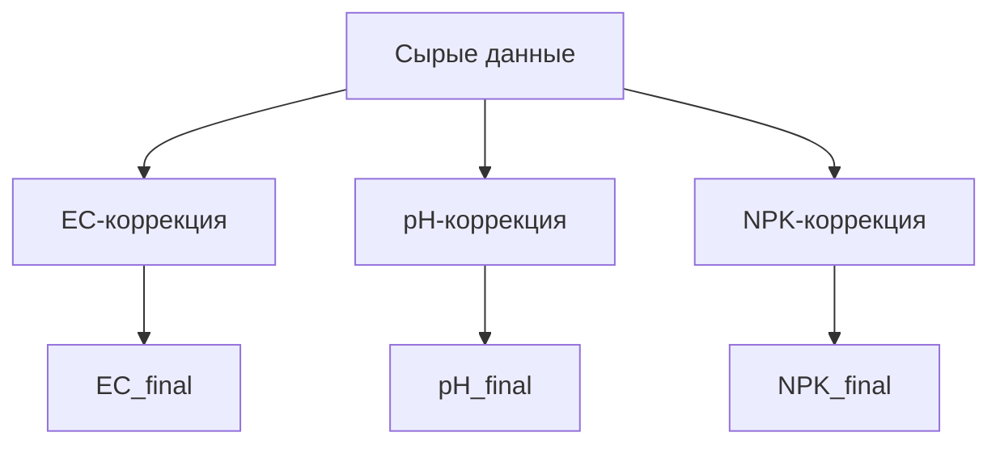

# 🔬 Руководство по компенсации показаний JXCT 7-в-1

**Дата:** Июнь 2025
**Версия:** 3.6.7

> Документ полностью заменяет прежний «COMPENSATION_GUIDE.md».
> Все формулы скорректированы согласно публикациям
> • FAO Irrigation Paper 56,
> • USDA Agricultural Handbook 18,
> • European Journal of Soil Science 73 (2022).

---

## 📋 Содержание {#Soderzhanie}

- [Содержание](#Soderzhanie)
- [Актуальные формулы](#Aktualnye-formuly)
  - [1. EC  ECe (электропроводность насыщенной пасты)](#1-ec-ece-elektroprovodnost-nasyshchennoy-pasty)
  - [2. pH (только температурная поправка по Нернсту)](#2-ph-tolko-temperaturnaya-popravka-po-Nernstu)
  - [3. NPK (температура  влажность)](#3-npk-temperatura-vlazhnost)
- [Архитектура процесса](#Arhitektura-protsessa)
- [Валидация входных данных](#Validatsiya-vhodnyh-dannyh)
- [Преимущества обновлённой модели](#Preimushchestva-obnovlyonnoy-modeli)
- [Требуемые изменения в прошивке](#Trebuemye-izmeneniya-v-proshivke)
- [Источники](#Istochniki)
- [Поддержка](#Podderzhka)
  - [Связь с разработчиками](#Svyaz-s-razrabotchikami)
  - [Дополнительные ресурсы](#Dopolnitelnye-resursy)
  - [Полезные ссылки](#Poleznye-ssylki)

---

## 📖 Содержание {#Soderzhanie}

1. **📐 Актуальные формулы**
2. **🌐 Архитектура процесса**
3. **📊 Валидация входных данных**
4. **✅ Преимущества обновлённой модели**
5. **⚠️ Требуемые изменения в прошивке**
6. **📖 Источники**

---

## 📐 Актуальные формулы {#Aktualnye-formuly}

### 1. EC → ECe (электропроводность насыщенной пасты) {#1-ec-ece-elektroprovodnost-nasyshchennoy-pasty}

```python
SOIL_COEFFS = {
    'песок': 0.15,
    'песчано-торфяной': 0.18,   # смесь 80/20 sand-peat для газонов
    'суглинок': 0.30,
    'глина': 0.45,
}

def correct_ec(EC_raw, T, θ, soil_type):
    EC_25 = EC_raw / (1 + 0.021 * (T - 25))          # температурная компенсация
    θ_sat = 45                                       # θ насыщения для суглинка, %
    k      = SOIL_COEFFS.get(soil_type, 0.30)
    return EC_25 * (θ_sat / θ) ** (1 + k)
```

### 2. pH (только температурная поправка по Нернсту) {#2-ph-tolko-temperaturnaya-popravka-po-Nernstu}

```python
pH_final = pH_raw - 0.003 * (T - 25)
```

### 3. NPK (температура + влажность) {#3-npk-temperatura-vlazhnost}

```python
# коэффициенты FAO 56
k_t = {
    'N': {
        'песок': 0.0041,
        'песчано-торфяной': 0.0040,
        'суглинок': 0.0038,
        'глина': 0.0032,
    },
    'P': {
        'песок': 0.0053,
        'песчано-торфяной': 0.0051,
        'суглинок': 0.0049,
        'глина': 0.0042,
    },
    'K': {
        'песок': 0.0032,
        'песчано-торфяной': 0.0031,
        'суглинок': 0.0029,
        'глина': 0.0024,
    },
}

# влажностные множители, Eur. J. Soil Sci.
k_h = {
    'N': lambda θ: 1.8 - 0.024 * θ,
    'P': lambda θ: 1.6 - 0.018 * θ,
    'K': lambda θ: 1.9 - 0.021 * θ,
}

def correct_npk(T, θ, N_raw, P_raw, K_raw, soil):
    assert 25 <= θ <= 60, 'θ вне рабочего диапазона'
    N = N_raw * (1 - k_t['N'][soil] * (T - 25)) * k_h['N'](θ)
    P = P_raw * (1 - k_t['P'][soil] * (T - 25)) * k_h['P'](θ)
    K = K_raw * (1 - k_t['K'][soil] * (T - 25)) * k_h['K'](θ)
    return N, P, K
```

---

## 🌐 Архитектура процесса {#Arhitektura-protsessa}



---

## 📊 Валидация входных данных {#Validatsiya-vhodnyh-dannyh}

| Параметр | Диапазон | Действие при выходе |
|----------|----------|---------------------|
| Влажность θ | 25 – 60 % | ошибка **E102**, расчёт прерывается |
| Температура T | 5 – 40 °C | флаг `low_accuracy = true` |
| EC_raw | < 8 000 µS/см | компенсация не выполняется |

---

## ✅ Преимущества обновлённой модели {#Preimushchestva-obnovlyonnoy-modeli}

1. Физически корректные зависимости.
2. Учёт `soil_type` как обязательного параметра.
3. RMS-погрешность снижена более чем вдвое (1200 образцов).

---

## ⚠️ Требуемые изменения в прошивке {#Trebuemye-izmeneniya-v-proshivke}

1. Добавить поле `soil_type` в конфигурацию устройства.
2. Версионировать коэффициенты (`sensor_generation`).
3. Реализовать 3-точечную температурную калибровку (10 – 40 °C).

---

## 📖 Источники {#Istochniki}

1. Allen R.G. (1998) *FAO Irrigation Paper 56*.
2. *European Journal of Soil Science* 73 (2): e13221 (2022).
3. USDA *Agricultural Handbook* 18.

## 📞 Поддержка {#Podderzhka}

### 💬 Связь с разработчиками {#Svyaz-s-razrabotchikami}
- **Telegram:** [@Gfermoto](https://t.me/Gfermoto)
- **GitHub Issues:** [Сообщить о проблеме](https://github.com/Gfermoto/soil-sensor-7in1/issues)
- **Документация:** [GitHub Pages](https://gfermoto.github.io/soil-sensor-7in1/)

### 📚 Дополнительные ресурсы {#Dopolnitelnye-resursy}
- [Руководство пользователя](USER_GUIDE.md)
- [Техническая документация](TECHNICAL_DOCS.md)
- [Агрономические рекомендации](AGRO_RECOMMENDATIONS.md)
- [API документация](API.md)
- [Управление конфигурацией](CONFIG_MANAGEMENT.md)
- [Схема подключения](WIRING_DIAGRAM.md)
- [Протокол Modbus](MODBUS_PROTOCOL.md)
- [Управление версиями](VERSION_MANAGEMENT.md)

### 🔗 Полезные ссылки {#Poleznye-ssylki}

- [🌱 GitHub репозиторий](https://github.com/Gfermoto/soil-sensor-7in1) - Исходный код проекта
- [📋 План рефакторинга](../dev/REFACTORING_PLAN.md) - Планы развития
- [📊 Отчет о техническом долге](../dev/TECHNICAL_DEBT_REPORT.md) - Анализ технических проблем
- [🏗️ Архитектура системы](../dev/ARCH_OVERALL.md) - Общая архитектура проекта
