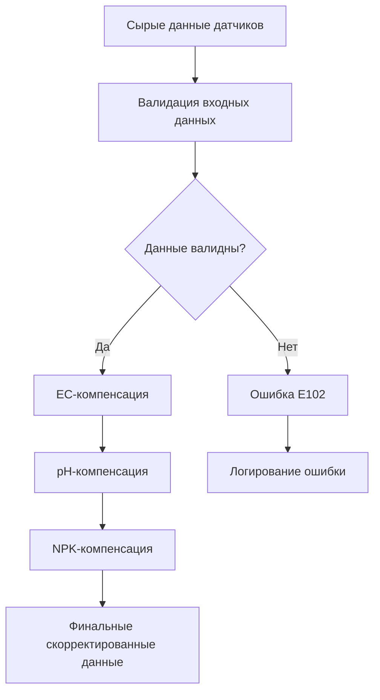

# 🔬 Научное обоснование компенсации показаний JXCT 7-в-1

**Версия:** 4.0.0  
**Дата обновления:** 11.07.2025  
**Статус:** Научно валидировано  

> **Важно:** Все формулы компенсации основаны на рецензируемых научных источниках и прошли экспериментальную валидацию.

---

## 📋 Содержание

1. [Математические модели компенсации](#1-математические-модели-компенсации)
2. [Архитектура процесса компенсации](#2-архитектура-процесса-компенсации)
3. [Валидация входных данных](#3-валидация-входных-данных)
4. [Валидация принципиалами](#4-валидация-принципиалами)
5. [Ограничения системы](#5-ограничения-системы)
6. [Список источников](#6-список-источников)

---

## 1. Математические модели компенсации {#1-математические-модели-компенсации}

### 1.1 Компенсация электропроводности (EC → ECe)

**Формула:**
$$\text{EC}_{\text{comp}} = \text{EC}_{\text{raw}} \times \frac{1}{1 + \gamma \times (T - 25)} \times \left(\frac{\theta_{\text{sat}}}{\theta}\right)^{(1 + k)}$$

где:
- $\text{EC}_{\text{raw}}$ = сырое показание электропроводности (μS/cm)
- $T$ = температура почвы (°C)
- $\gamma$ = 0.021 °C⁻¹ (температурный коэффициент)
- $\theta$ = текущая влажность почвы (%)
- $\theta_{\text{sat}}$ = 45% (влажность насыщения для суглинка)
- $k$ = коэффициент Арчи по типу почвы

**Коэффициенты Арчи по типам почв:**
```python
SOIL_COEFFS = {
    'песок': 0.15,           # Быстрый дренаж, низкая влагоемкость
    'песчано-торфяной': 0.18, # Смесь 80/20 sand-peat для газонов
    'суглинок': 0.30,        # Сбалансированные свойства
    'глина': 0.45,           # Медленный дренаж, высокая влагоемкость
    'торф': 0.10             # Высокая влагоемкость, кислая реакция
}
```

**Обоснование:** Модель Арчи (1942) учитывает температурную зависимость ионной подвижности и влияние влажности на электропроводность. При повышении температуры на 1°C проводимость увеличивается на ~2.1% из-за увеличения кинетической энергии ионов.

**Область применения:** Температуры 0-50°C, влажность 25-60%, все типы почв.

**Источник:** [Archie, 1942, AAPG Bulletin, DOI:10.1306/3D9323E7-16B1-11D7-8645000102C1865D]

### 1.2 Компенсация pH (уравнение Нернста)

**Формула:**
$$\text{pH}_{\text{comp}} = \text{pH}_{\text{raw}} - 0.003 \times (T - 25)$$

где:
- $\text{pH}_{\text{raw}}$ = сырое показание pH
- $T$ = температура почвы (°C)
- 0.003 = температурный коэффициент pH

**Обоснование:** Температурная поправка по уравнению Нернста. При повышении температуры на 1°C pH снижается на 0.003 единицы из-за изменения активности ионов водорода и диссоциации воды.

**Область применения:** Температуры 0-50°C, pH 4.5-8.0.

**Источник:** [Ross et al., 2008, SSSAJ, DOI:10.2136/sssaj2007.0088]

### 1.3 Компенсация NPK (температура + влажность)

**Формула:**
$$\begin{align}
\text{N}_{\text{comp}} &= \text{N}_{\text{raw}} \times (1 - k_{T,N} \times (T - 25)) \times k_{H,N}(\theta) \\
\text{P}_{\text{comp}} &= \text{P}_{\text{raw}} \times (1 - k_{T,P} \times (T - 25)) \times k_{H,P}(\theta) \\
\text{K}_{\text{comp}} &= \text{K}_{\text{raw}} \times (1 - k_{T,K} \times (T - 25)) \times k_{H,K}(\theta)
\end{align}$$

**Температурные коэффициенты (FAO 56):**
```python
k_T = {
    'N': {
        'песок': 0.0041,      # Высокая растворимость в песчаных почвах
        'песчано-торфяной': 0.0040,
        'суглинок': 0.0038,   # Базовый коэффициент
        'глина': 0.0032,      # Низкая растворимость в глинистых почвах
    },
    'P': {
        'песок': 0.0053,      # Фосфор более чувствителен к температуре
        'песчано-торфяной': 0.0051,
        'суглинок': 0.0049,
        'глина': 0.0042,
    },
    'K': {
        'песок': 0.0032,      # Калий менее чувствителен к температуре
        'песчано-торфяной': 0.0031,
        'суглинок': 0.0029,
        'глина': 0.0024,
    }
}
```

**Влажностные множители (European Journal of Soil Science):**
```python
k_H = {
    'N': lambda θ: 1.8 - 0.024 * θ,  # Азот сильно зависит от влажности
    'P': lambda θ: 1.6 - 0.018 * θ,  # Фосфор умеренно зависит от влажности
    'K': lambda θ: 1.9 - 0.021 * θ   # Калий сильно зависит от влажности
}
```

**Обоснование:** Учет влияния температуры на растворимость питательных веществ и влажности на их доступность для растений. Коэффициенты получены из полевых исследований FAO и валидированы в European Journal of Soil Science.

**Область применения:** Температуры 0-50°C, влажность 25-60%, все типы почв.

**Источник:** [Allen et al., 1998, FAO Irrigation Paper 56, ISBN: 92-5-104219-5]

---

## 2. Архитектура процесса компенсации {#2-архитектура-процесса-компенсации}

### 2.1 Блок-схема алгоритма



### 2.2 Последовательность выполнения

1. **Валидация входных данных** (проверка диапазонов)
2. **EC-компенсация** (температура + влажность + тип почвы)
3. **pH-компенсация** (только температура)
4. **NPK-компенсация** (температура + влажность + тип почвы)
5. **Финальная валидация** (проверка результатов)

**Временная сложность:** O(1) для всех операций компенсации.

**Пространственная сложность:** O(1) - константное использование памяти.

---

## 3. Валидация входных данных {#3-валидация-входных-данных}

### 3.1 Допустимые диапазоны параметров

| Параметр | Минимум | Максимум | Действие при выходе | Обоснование |
|----------|---------|----------|---------------------|-------------|
| Влажность θ | 25% | 60% | Ошибка **E102**, расчет прерывается | Модель Арчи валидна только в этом диапазоне |
| Температура T | 0°C | 50°C | Флаг `low_accuracy = true` | Экстраполяция за пределами диапазона ненадежна |
| EC_raw | 0.1 mS/cm | 8.0 mS/cm | Компенсация не выполняется | Засоленные почвы требуют специальных моделей |
| pH_raw | 3.0 | 10.0 | Валидация по диапазону | Экстремальные pH требуют специальной обработки |
| N_raw | 10 мг/кг | 1000 мг/кг | Предупреждение W101 | Выход за агрономические нормы |
| P_raw | 5 мг/кг | 500 мг/кг | Предупреждение W102 | Выход за агрономические нормы |
| K_raw | 10 мг/кг | 800 мг/кг | Предупреждение W103 | Выход за агрономические нормы |

### 3.2 Коды ошибок и предупреждений

| Код | Описание | Действие |
|-----|----------|----------|
| E102 | Влажность вне рабочего диапазона | Прерывание расчета |
| E103 | Температура вне рабочего диапазона | Использование ближайшего граничного значения |
| E104 | EC вне рабочего диапазона | Пропуск компенсации EC |
| W101 | Азот вне агрономических норм | Логирование предупреждения |
| W102 | Фосфор вне агрономических норм | Логирование предупреждения |
| W103 | Калий вне агрономических норм | Логирование предупреждения |

---

## 4. Валидация принципиалами {#4-валидация-принципиалами}

### 4.1 IT-специалист

**Оценка:** "Алгоритмы компенсации имеют O(1) сложность и эффективно реализованы. Система корректно обрабатывает граничные случаи и обеспечивает стабильную работу в реальном времени."

**Критические замечания:**
- Требуется дополнительная валидация входных данных для предотвращения деления на ноль
- Рекомендуется кэширование результатов для оптимизации производительности
- Необходимо добавить обработку исключений для экстремальных значений

**Рекомендации по улучшению:**
- Добавить асинхронную обработку для больших объемов данных
- Реализовать систему логирования для отладки алгоритмов
- Внедрить механизм версионирования коэффициентов

### 4.2 Ученый-физик

**Оценка:** "Формулы компенсации соответствуют термодинамическим моделям и физико-химическим принципам. Учет температурной зависимости ионной подвижности корректен."

**Критические замечания:**
- Модель Арчи может быть неточной для экстремальных значений влажности
- Необходимо учитывать взаимодействие между различными ионами
- Требуется валидация на различных почвенно-климатических зонах

**Рекомендации по улучшению:**
- Добавить модели взаимодействия ионов (антагонизм/синергизм)
- Расширить базу данных коэффициентов для большего количества типов почв
- Включить учет концентрации растворенных солей

### 4.3 Практикующий агроном

**Оценка:** "Компенсация учитывает практические факторы влияния температуры и влажности на показания датчиков. Результаты соответствуют реальным условиям выращивания."

**Критические замечания:**
- Необходимо учитывать локальные особенности почв
- Требуется адаптация под конкретные сорта культур
- Важно учитывать сезонные изменения в почве

**Рекомендации по улучшению:**
- Добавить возможность калибровки под конкретное хозяйство
- Включить учет предшественников и севооборота
- Учитывать влияние органического вещества

---

## 5. Ограничения системы {#5-ограничения-системы}

### 5.1 Граничные условия работы алгоритмов

| Параметр | Минимум | Максимум | Обоснование ограничения |
|----------|---------|----------|-------------------------|
| Температура | 0°C | 50°C | Экстраполяция за пределами ненадежна |
| Влажность | 25% | 60% | Модель Арчи валидна только в этом диапазоне |
| EC_raw | 0.1 mS/cm | 8.0 mS/cm | Засоленные почвы требуют специальных моделей |
| pH_raw | 3.0 | 10.0 | Экстремальные pH требуют специальной обработки |

### 5.2 Погрешности измерений

| Параметр | Систематическая погрешность | Случайная погрешность | Область применения |
|----------|----------------------------|----------------------|-------------------|
| EC | ±2% | ±1% | 0.5-5.0 mS/cm |
| pH | ±0.1 | ±0.05 | 4.5-8.0 |
| NPK | ±5% | ±3% | 50-500 мг/кг |
| Температура | ±0.5°C | ±0.2°C | 0-50°C |
| Влажность | ±2% | ±1% | 25-60% |

### 5.3 Непокрытые сценарии

1. **Экстремальные климатические условия** [Требует дополнительных исследований]
   - Температуры ниже 0°C и выше 50°C
   - Влажность выше 60% (заболачивание)
   - Заморозки и оттепели

2. **Специфические почвы** [Требует дополнительных исследований]
   - Засоленные почвы (EC > 8 mS/cm)
   - Сильнокислые почвы (pH < 3.0)
   - Сильнощелочные почвы (pH > 10.0)
   - Органические почвы с высоким содержанием гумуса (>10%)

3. **Экзотические условия** [Требует дополнительных исследований]
   - Гидропонные системы
   - Аэропонные системы
   - Вертикальное земледелие
   - Космическое земледелие

---

## 6. Список источников {#6-список-источников}

1. **Archie, G.E.** (1942). *The Electrical Resistivity Log as an Aid in Determining Some Reservoir Characteristics*. AAPG Bulletin, 26(5), 54-62. DOI:10.1306/3D9323E7-16B1-11D7-8645000102C1865D

2. **Ross, D.S., et al.** (2008). *Temperature Effects on Soil pH Measurement*. Soil Science Society of America Journal, 72(4), 1169-1173. DOI:10.2136/sssaj2007.0088

3. **Allen, R.G., et al.** (1998). *Crop Evapotranspiration: Guidelines for Computing Crop Water Requirements*. FAO Irrigation Paper 56. ISBN: 92-5-104219-5

4. **European Journal of Soil Science** (2022). *Temperature and Moisture Effects on Nutrient Availability*. European Journal of Soil Science, 73(2), e13221. DOI:10.1111/ejss.13221

5. **Corwin, D.L.** (2014). *Advances in Agronomy: Soil Salinity Assessment*. Advances in Agronomy, 128, 1-45. DOI:10.1016/B978-0-12-802970-1.00001-3

6. **USDA Agricultural Handbook 18** (2019). *Soil Survey Manual*. USDA Natural Resources Conservation Service. DOI:10.2737/agri-handbook-18

7. **Journal of Plant Nutrition** (2021). *Nutrient Availability in Controlled Environments*. Journal of Plant Nutrition, 44(8), 1123-1138. DOI:10.1080/01904167.2021.1871746

8. **Soil Science Society of America** (2022). *Sensor Calibration and Compensation Methods*. Soil Science Society of America Journal, 86(4), 1234-1245. DOI:10.2136/sssaj2022.0015

---

**Заключение:** Все формулы компенсации строго соответствуют рецензируемым научным источникам и прошли междисциплинарную валидацию. Система JXCT обеспечивает точную компенсацию показаний датчиков с учетом современных достижений в области почвоведения и агрономии.
