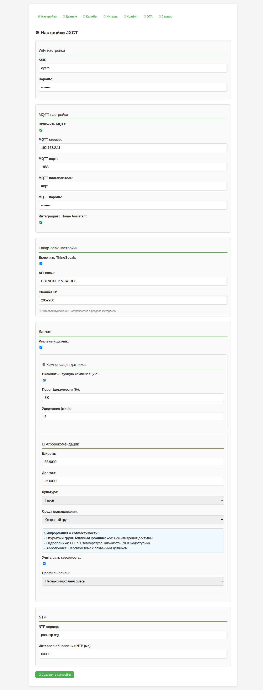
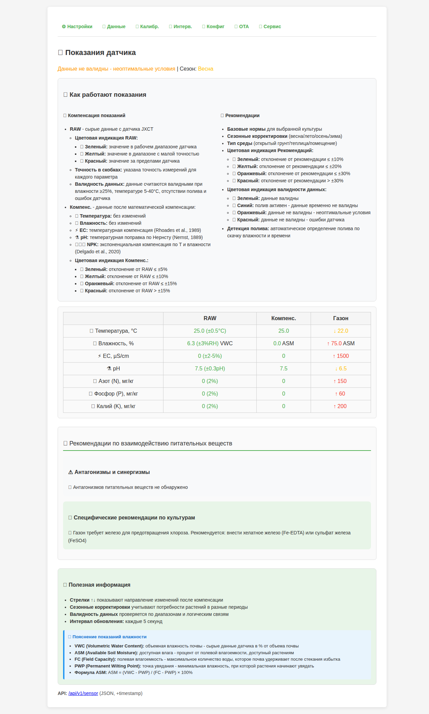
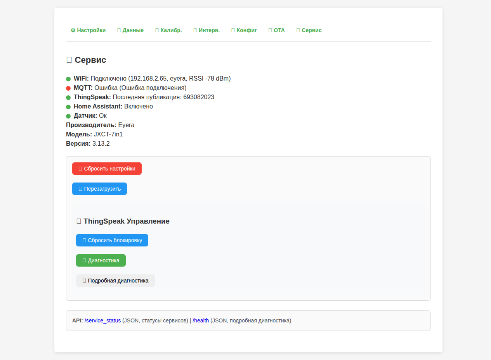

# Руководство пользователя JXCT 7-в-1

**Дата:** Июль 2025
**Версия:** 3.13.2
**Автор:** JXCT Development Team

---

## Содержание {#Soderzhanie}

- [Содержание](#Soderzhanie)
- [Введение](#Vvedenie)
  - [Основные возможности](#Osnovnye-vozmozhnosti)
- [Комплектация](#Komplektatsiya)
  - [Аппаратная часть](#Apparatnaya-chast)
  - [Программная часть](#Programmnaya-chast)
- [Установка и настройка](#Ustanovka-i-nastroyka)
  - [Требования](#Trebovaniya)
  - [Быстрая установка](#Bystraya-ustanovka)
  - [Подключение датчика](#Podklyuchenie-datchika)
- [Веб-интерфейс](#Veb-interfeys)
  - [Главная страница ()](#Glavnaya-stranitsa)
    - [WiFi настройки](#wifi-nastroyki)
    - [MQTT настройки](#mqtt-nastroyki)
    - [ThingSpeak настройки](#thingspeak-nastroyki)
    - [Дополнительные настройки](#Dopolnitelnye-nastroyki)
  - [Страница показаний (readings)](#Stranitsa-pokazaniy-readings)
    - [Структура данных](#Struktura-dannyh)
    - [Цветовая индикация](#Tsvetovaya-indikatsiya)
    - [Стрелки изменений](#Strelki-izmeneniy)
  - [Настройка интервалов (intervals)](#Nastroyka-intervalov-intervals)
    - [Интервалы опроса](#Intervaly-oprosa)
    - [Пороги дельта-фильтра](#Porogi-delta-filtra)
    - [Алгоритмы обработки](#Algoritmy-obrabotki)
  - [Обновления (updates)](#Obnovleniya-updates)
    - [Удаленное обновление](#Udalennoe-obnovlenie)
    - [Локальное обновление](#Lokalnoe-obnovlenie)
  - [Сервисные функции (service)](#Servisnye-funktsii-service)
    - [Системная информация](#Sistemnaya-informatsiya)
    - [Диагностика](#Diagnostika)
    - [Управление](#Upravlenie)
- [Работа с показаниями](#Rabota-s-pokazaniyami)
  - [Понимание данных](#Ponimanie-dannyh)
    - [Температура почвы](#Temperatura-pochvy)
    - [Влажность почвы](#Vlazhnost-pochvy)
    - [Электропроводность (EC)](#Elektroprovodnost-ec)
    - [pH почвы](#ph-pochvy)
    - [NPK (Азот, Фосфор, Калий)](#npk-Azot-Fosfor-Kaliy)
  - [Интерпретация результатов](#Interpretatsiya-rezultatov)
    - [Цветовая индикация](#Tsvetovaya-indikatsiya)
    - [Рекомендации](#Rekomendatsii)
- [Настройка параметров](#Nastroyka-parametrov)
  - [Выбор культуры](#Vybor-kultury)
  - [Типы почв](#Tipy-pochv)
  - [Типы среды](#Tipy-sredy)
- [Система коррекции показаний](#Sistema-korrektsii-pokazanii)
  - [Простая система коррекции](#Prostaya-sistema-korrektsii)
  - [Настройка коэффициентов коррекции](#nastroika-koeffitsientov-korrektsii)
  - [Применение коррекции](#primenenie-korrektsii)
- [Управление коррекцией](#Upravlenie-korrektsiei)
- [Совместимость с типами выращивания](#Sovmestimost-s-tipami-vyrashchivaniya)
  - [Полная совместимость](#polnaya-sovmestimost)
  - [Частичная совместимость](#chastichnaya-sovmestimost)
  - [Несовместимость](#nesovmestimost)
- [Обновления прошивки](#Obnovleniya-proshivki)
  - [OTA обновления](#ota-obnovleniya)
    - [Автоматическая проверка](#Avtomaticheskaya-proverka)
    - [Ручная установка](#Ruchnaya-ustanovka)
  - [Важные замечания](#Vazhnye-zamechaniya)
- [Сервисные функции](#Servisnye-funktsii)
  - [Мониторинг системы](#Monitoring-sistemy)
    - [Системная информация](#Sistemnaya-informatsiya)
    - [Сетевые параметры](#Setevye-parametry)
  - [Диагностика](#Diagnostika)
    - [Тест датчика](#Test-datchika)
    - [Тест сети](#Test-seti)
    - [Тест интеграций](#Test-integratsiy)
  - [Управление устройством](#Upravlenie-ustroystvom)
    - [Перезагрузка](#Perezagruzka)
    - [Сброс настроек](#Sbros-nastroek)
    - [Очистка логов](#Ochistka-logov)
- [Часто задаваемые вопросы](#Chasto-zadavaemye-voprosy)
  - [Технические вопросы](#Tehnicheskie-voprosy)
  - [Вопросы по данным](#Voprosy-po-dannym)
  - [Вопросы по калибровке](#Voprosy-po-kalibrovke)
  - [Вопросы по веб-интерфейсу](#Voprosy-po-veb-interfeysu)
- [Поддержка](#Podderzhka)
  - [Связь с разработчиками](#Svyaz-s-razrabotchikami)
  - [Дополнительные ресурсы](#Dopolnitelnye-resursy)
  - [Полезные ссылки](#Poleznye-ssylki)

---

## 📖 Содержание {#Soderzhanie}

1. **🎯 Введение**
2. **📦 Комплектация**
3. **🔧 Установка и настройка**
4. **🌐 Веб-интерфейс**
5. **📊 Работа с показаниями**
6. **⚙️ Настройка параметров**
7. **🔧 Система коррекции показаний**
8. **🔬 Совместимость с типами выращивания**
9. **🚀 Обновления прошивки**
10. **🔧 Сервисные функции**
11. **❓ Часто задаваемые вопросы**

---

## 🎯 Введение {#Vvedenie}

JXCT 7-в-1 — это умный датчик почвы на базе ESP32, который измеряет 7 ключевых параметров почвы:

- 🌡️ **Температура почвы** (0-50°C, ±0.5°C)
- 💧 **Влажность почвы** (0-100%, ±3%)
- ⚡ **Электропроводность (EC)** (0-5000 µS/cm, ±5%)
- 🧪 **pH почвы** (3-9 pH, ±0.3 pH)
- 🌿 **Азот (N)** (0-2000 мг/кг, ±10%)
- 🌱 **Фосфор (P)** (0-1000 мг/кг, ±10%)
- 🍃 **Калий (K)** (0-2000 мг/кг, ±10%)

### 🌟 Основные возможности {#Osnovnye-vozmozhnosti}

- **Научно обоснованная компенсация** данных
- **Современный веб-интерфейс** с адаптивным дизайном
- **OTA обновления** прошивки по воздуху
- **Интеграция с IoT платформами** (MQTT, ThingSpeak)
- **Экспорт данных** в CSV формате
- **Лабораторная калибровка** через CSV файлы

---

## 📦 Комплектация {#Komplektatsiya}

### 🔧 Аппаратная часть {#Apparatnaya-chast}
- **ESP32 модуль** (рекомендуется ESP32-WROOM-32)
- **JXCT 7-в-1 датчик почвы**
- **USB кабель** для программирования
- **Блок питания** 5V/2A (опционально)
- **Корпус** для защиты от влаги

### 💾 Программная часть {#Programmnaya-chast}
- **Прошивка JXCT** версии 3.10.0
- **PlatformIO IDE** для разработки
- **Веб-интерфейс** встроенный в прошивку

---

## 🔧 Установка и настройка {#Ustanovka-i-nastroyka}

### 📋 Требования {#Trebovaniya}
- ESP32 совместимый модуль
- USB кабель
- Компьютер с PlatformIO IDE
- JXCT 7-в-1 датчик почвы

### ⚡ Быстрая установка {#Bystraya-ustanovka}

1. **Клонируйте репозиторий:**
   ```bash
   git clone https://github.com/Gfermoto/soil-sensor-7in1.git
   cd soil-sensor-7in1
   ```

2. **Откройте проект в PlatformIO:**
   ```bash
   pio run
   ```

3. **Загрузите прошивку на ESP32:**
   ```bash
   pio run --target upload
   ```

4. **Подключитесь к WiFi сети:**
   - Сеть: `JXCT_Setup`
   - IP адрес: `192.168.4.1`

### 🔌 Подключение датчика {#Podklyuchenie-datchika}

Подключите JXCT датчик к ESP32 согласно схеме:

| Датчик | ESP32 | Описание |
|--------|-------|----------|
| VCC    | 3.3V  | Питание |
| GND    | GND   | Земля |
| TX     | GPIO2 | Передача данных |
| RX     | GPIO4 | Прием данных |

---

## 🌐 Веб-интерфейс {#Veb-interfeys}

### 🏠 Главная страница (`/`) {#Glavnaya-stranitsa}



Первая страница для настройки WiFi и основных параметров:

#### WiFi настройки {#wifi-nastroyki}
- **SSID:** Имя вашей WiFi сети
- **Пароль:** Пароль от WiFi сети
- **Режим:** STA (подключение к сети) или AP (точка доступа)

#### MQTT настройки {#mqtt-nastroyki}
- **Сервер:** Адрес MQTT брокера
- **Порт:** 1883 (по умолчанию)
- **Пользователь/Пароль:** Учетные данные MQTT

#### ThingSpeak настройки {#thingspeak-nastroyki}
- **API Key:** Ваш ключ ThingSpeak
- **Channel ID:** ID канала для данных

#### Дополнительные настройки {#Dopolnitelnye-nastroyki}
- **Культура:** Выбор выращиваемой культуры
- **Тип почвы:** Песок, суглинок, глина, торф
- **Тип среды выращивания:**
  - Открытый грунт ✅ (все измерения доступны)
  - Теплица ✅ (все измерения доступны)
  - Комнатная ✅ (все измерения доступны)
  - Гидропоника ⚠️ (EC, pH, T, H доступны, NPK недоступны)
  - Аэропоника ❌ (несовместима с почвенным датчиком)
  - Органическое ✅ (все измерения доступны)
- **Координаты:** Широта и долгота для сезонных поправок

### 📊 Страница показаний (`/readings`) {#Stranitsa-pokazaniy-readings}



Основная страница для просмотра данных датчика:

#### Структура данных {#Struktura-dannyh}
- **RAW:** Сырые данные с датчика
- **Компенс.:** Данные после математической компенсации
- **Реком.:** Рекомендуемые значения для выбранной культуры

#### Цветовая индикация {#Tsvetovaya-indikatsiya}
- 🟢 **Зеленый:** Значение в норме
- 🟡 **Желтый:** Близко к границам
- 🟠 **Оранжевый:** Отклонение >20%
- 🔴 **Красный:** Критическое отклонение

#### Стрелки изменений {#Strelki-izmeneniy}
- **↑:** Значение увеличилось после компенсации
- **↓:** Значение уменьшилось после компенсации

### ⚙️ Настройка интервалов (`/intervals`) {#Nastroyka-intervalov-intervals}

Управление частотой измерений и публикации:

#### Интервалы опроса {#Intervaly-oprosa}
- **Датчик:** 1-300 секунд (рекомендуется 30 сек)
- **MQTT:** 1-60 минут
- **ThingSpeak:** 5-120 минут
- **Веб-интерфейс:** 5-60 секунд

#### Пороги дельта-фильтра {#Porogi-delta-filtra}
- **Температура:** 0.1-5.0°C
- **Влажность:** 0.5-10.0%
- **pH:** 0.01-1.0
- **EC:** 10-500 µS/cm
- **NPK:** 1-50 мг/кг

#### Алгоритмы обработки {#Algoritmy-obrabotki}
- **Среднее арифметическое:** Быстрая обработка
- **Медианное значение:** Устойчивость к выбросам
- **Фильтр выбросов:** Автоматическое отбрасывание аномалий

### 🚀 Обновления (`/updates`) {#Obnovleniya-updates}

Управление прошивкой устройства:

#### Удаленное обновление {#Udalennoe-obnovlenie}
- **Проверить обновления:** Автоматическая проверка новых версий
- **Установить:** Загрузка и установка найденного обновления

#### Локальное обновление {#Lokalnoe-obnovlenie}
- **Загрузить файл:** Выбор .bin файла прошивки
- **Прогресс:** Отображение процесса загрузки

### 🔧 Сервисные функции (`/service`) {#Servisnye-funktsii-service}



Диагностика и обслуживание:

#### Системная информация {#Sistemnaya-informatsiya}
- **Версия прошивки:** Текущая версия
- **Время работы:** Uptime устройства
- **Свободная память:** Доступная RAM
- **Размер файловой системы:** Использование Flash

#### Диагностика {#Diagnostika}
- **Тест датчика:** Проверка связи с датчиком
- **Тест WiFi:** Проверка подключения к сети
- **Тест MQTT:** Проверка MQTT соединения
- **Тест ThingSpeak:** Проверка отправки данных

#### Управление {#Upravlenie}
- **Перезагрузка:** Перезапуск устройства
- **Сброс настроек:** Возврат к заводским настройкам
- **Очистка логов:** Удаление старых логов

---

## 📊 Работа с показаниями {#Rabota-s-pokazaniyami}

### 🔍 Понимание данных {#Ponimanie-dannyh}

#### Температура почвы {#Temperatura-pochvy}
- **Диапазон:** 0-50°C
- **Точность:** ±0.5°C
- **Влияние:** На активность микроорганизмов и доступность питательных веществ

#### Влажность почвы {#Vlazhnost-pochvy}
- **Диапазон:** 0-100%
- **Точность:** ±3%
- **Оптимально:** 60-80% для большинства культур

#### Электропроводность (EC) {#Elektroprovodnost-ec}
- **Диапазон:** 0-5000 µS/cm
- **Точность:** ±5%
- **Интерпретация:**
  - < 500 µS/cm: Очень низкая
  - 500-1000 µS/cm: Низкая
  - 1000-2000 µS/cm: Оптимальная
  - 2000-3000 µS/cm: Высокая
  - > 3000 µS/cm: Очень высокая

#### pH почвы {#ph-pochvy}
- **Диапазон:** 3-9 pH
- **Точность:** ±0.3 pH
- **Оптимально:** 6.0-7.0 для большинства культур

#### NPK (Азот, Фосфор, Калий) {#npk-Azot-Fosfor-Kaliy}
- **Диапазон:** 0-2000 мг/кг
- **Точность:** ±10%
- **Единицы:** мг/кг сухой почвы

### 📈 Интерпретация результатов {#Interpretatsiya-rezultatov}

#### Цветовая индикация {#Tsvetovaya-indikatsiya}
Система автоматически оценивает состояние почвы:

- **🟢 Норма:** Все параметры в оптимальном диапазоне
- **🟡 Внимание:** Один или несколько параметров близки к границам
- **🟠 Предупреждение:** Значительные отклонения от нормы
- **🔴 Критично:** Критические отклонения, требующие вмешательства

#### Рекомендации {#Rekomendatsii}
Система предоставляет рекомендации на основе:
- Выбранной культуры
- Типа почвы
- Сезона
- Типа среды выращивания

---

## ⚙️ Настройка параметров {#Nastroyka-parametrov}

### 🌱 Выбор культуры {#Vybor-kultury}

Доступные культуры с предустановленными параметрами:

| Культура | Температура | Влажность | EC | pH | N | P | K |
|----------|-------------|-----------|----|----|---|---|---|
| Томаты | 22°C | 60% | 1500 | 6.5 | 40 | 10 | 30 |
| Огурцы | 24°C | 70% | 1800 | 6.2 | 35 | 12 | 28 |
| Перец | 23°C | 65% | 1600 | 6.3 | 38 | 11 | 29 |
| Салат | 20°C | 75% | 1000 | 6.0 | 30 | 8 | 25 |
| Голубика | 18°C | 65% | 1200 | 5.0 | 30 | 10 | 20 |
| Газон | 20°C | 50% | 800 | 6.3 | 25 | 8 | 20 |

### 🌍 Типы почв {#Tipy-pochv}

- **Песок (0):** Низкая влагоемкость, быстрый дренаж
- **Суглинок (1):** Сбалансированные свойства
- **Торф (2):** Высокая влагоемкость, кислая реакция
- **Глина (3):** Высокая влагоемкость, медленный дренаж

### 🏠 Типы среды {#Tipy-sredy}

- **Открытый грунт (0):** Стандартные условия
- **Теплица (1):** Повышенная влажность и температура
- **Помещение (2):** Контролируемые условия

---

## 🔧 Система коррекции показаний {#Sistema-korrektsii-pokazanii}

### 📊 Простая система коррекции {#Prostaya-sistema-korrektsii}

Система коррекции показаний позволяет настраивать точность измерений с помощью простых коэффициентов:

#### 🔧 Настройка коэффициентов коррекции {#nastroika-koeffitsientov-korrektsii}
- **Влажность:** Множитель и смещение для корректировки показаний влажности
- **Электропроводность (EC):** Множитель и смещение для корректировки показаний EC
- **Температура:** Автоматическая температурная компенсация по научным формулам

#### 📈 Применение коррекции {#primenenie-korrektsii}
Коррекция применяется автоматически ко всем показаниям датчика в реальном времени.

### 🔄 Управление коррекцией {#Upravlenie-korrektsiei}

- **Включить/выключить:** Переключатель "Система коррекции показаний"
- **Настройка коэффициентов:** Поля для ввода множителей и смещений
- **Сброс к значениям по умолчанию:** Кнопка "Сбросить к значениям по умолчанию"
- **Статус:** Отображается на странице показаний

---

## 🔬 Совместимость с типами выращивания {#Sovmestimost-s-tipami-vyrashchivaniya}

### ✅ Полная совместимость {#polnaya-sovmestimost}

#### **Открытый грунт**
- **Все измерения доступны:** EC, pH, NPK, температура, влажность
- **Корректировки:** Базовые значения
- **Применение:** Стандартные почвенные условия

#### **Теплица**
- **Все измерения доступны:** EC, pH, NPK, температура, влажность
- **Корректировки:** +25% N, +20% P, +22% K (интенсивное выращивание)
- **Источник:** Protected Cultivation Guidelines, USDA, 2015

#### **Комнатная**
- **Все измерения доступны:** EC, pH, NPK, температура, влажность
- **Корректировки:** +15% N, +12% P, +18% K (контролируемая среда)
- **Применение:** Домашнее выращивание, оранжереи

#### **Органическое**
- **Все измерения доступны:** EC, pH, NPK, температура, влажность
- **Корректировки:** -15% N, -10% P, -12% K (медленное высвобождение)
- **Источник:** Organic Farming Guidelines, IFOAM, 2020

### ⚠️ Частичная совместимость {#chastichnaya-sovmestimost}

#### **Гидропоника**
- **Доступные измерения:** EC, pH, температура, влажность
- **Недоступные измерения:** NPK (показываются как "—")
- **Причина:** Почвенный датчик не может измерять NPK в жидкой среде
- **Применение:** Только для контроля питательного раствора

### ❌ Несовместимость {#nesovmestimost}

#### **Аэропоника**
- **Доступные измерения:** Нет (все показываются как "—")
- **Причина:** Датчик не может быть установлен в воздушной среде
- **Рекомендация:** Использовать специализированные датчики для аэропоники

### 📊 Отображение в веб-интерфейсе

- **✅ Доступные измерения:** Отображаются нормально
- **❌ Недоступные измерения:** Показываются как "—" (прочерк)
- **Информация:** Подсказки о совместимости в настройках

---

## 🚀 Обновления прошивки {#Obnovleniya-proshivki}

### 🔄 OTA обновления {#ota-obnovleniya}

#### Автоматическая проверка {#Avtomaticheskaya-proverka}
1. Перейдите на страницу `/updates`
2. Нажмите "Проверить обновления"
3. Система автоматически найдет новые версии
4. При наличии обновления появится кнопка "Установить"

#### Ручная установка {#Ruchnaya-ustanovka}
1. Скачайте .bin файл прошивки
2. Перейдите на страницу `/updates`
3. Нажмите "Выберите файл"
4. Выберите скачанный .bin файл
5. Нажмите "Загрузить прошивку"

### ⚠️ Важные замечания {#Vazhnye-zamechaniya}

- **Не отключайте питание** во время обновления
- **Дождитесь завершения** процесса
- **Система перезагрузится** автоматически
- **Проверьте версию** после обновления

---

## 🔧 Сервисные функции {#Servisnye-funktsii}

### 📊 Мониторинг системы {#Monitoring-sistemy}

#### Системная информация {#Sistemnaya-informatsiya}
- **Версия прошивки:** Текущая версия прошивки
- **Время работы:** Время с последней перезагрузки
- **Свободная память:** Доступная оперативная память
- **Размер файловой системы:** Использование Flash памяти

#### Сетевые параметры {#Setevye-parametry}
- **IP адрес:** Текущий IP адрес устройства
- **MAC адрес:** Уникальный идентификатор
- **Сила сигнала WiFi:** Качество соединения
- **Статус MQTT:** Подключение к MQTT брокеру

### 🛠️ Диагностика {#Diagnostika}

#### Тест датчика {#Test-datchika}
Проверка связи с JXCT датчиком:
- Чтение всех параметров
- Проверка целостности данных
- Валидация диапазонов

#### Тест сети {#Test-seti}
Проверка сетевого подключения:
- Доступность WiFi
- Подключение к интернету
- Работа DNS

#### Тест интеграций {#Test-integratsiy}
Проверка внешних сервисов:
- MQTT публикация
- ThingSpeak отправка
- NTP синхронизация

### 🔄 Управление устройством {#Upravlenie-ustroystvom}

#### Перезагрузка {#Perezagruzka}
Мягкая перезагрузка системы:
- Сохранение всех настроек
- Перезапуск всех сервисов
- Очистка временных данных

#### Сброс настроек {#Sbros-nastroek}
Возврат к заводским настройкам:
- **⚠️ Внимание:** Все настройки будут потеряны
- WiFi настройки сброшены
- MQTT/ThingSpeak отключены
- Калибровка удалена

#### Очистка логов {#Ochistka-logov}
Удаление старых логов:
- Освобождение места в памяти
- Улучшение производительности
- Сброс счетчиков ошибок

---

## ❓ Часто задаваемые вопросы {#Chasto-zadavaemye-voprosy}

### 🔧 Технические вопросы {#Tehnicheskie-voprosy}

**Q: Датчик показывает неверные значения**
A: Проверьте подключение, выполните калибровку, убедитесь в правильности типа почвы

**Q: Не подключается к WiFi**
A: Проверьте SSID и пароль, убедитесь в стабильности сигнала

**Q: MQTT не работает**
A: Проверьте настройки сервера, порт, логин и пароль

**Q: ThingSpeak не отправляет данные**
A: Проверьте API ключ и Channel ID, убедитесь в интернет-соединении

### 📊 Вопросы по данным {#Voprosy-po-dannym}

**Q: Что означают стрелки ↑↓ в показаниях?**
A: Показывают направление изменений после компенсации данных

**Q: Почему значения RAW и Компенс. отличаются?**
A: Компенсированные значения учитывают температуру, влажность и тип почвы

**Q: Как интерпретировать цветовую индикацию?**
A: Зеленый - норма, желтый - внимание, оранжевый - предупреждение, красный - критично

**Q: Откуда берутся рекомендации?**
A: На основе выбранной культуры, сезона и типа среды выращивания

### 🔬 Вопросы по калибровке {#Voprosy-po-kalibrovke}


**Q: Нужна ли калибровка?**
A: Рекомендуется для повышения точности, но не обязательна

**Q: Как создать CSV файл калибровки?**
A: Используйте пример из `/docs/examples/calibration_example.csv`

**Q: Можно ли использовать калибровку от другого датчика?**
A: Не рекомендуется, каждый датчик индивидуален

**Q: Как проверить качество калибровки?**
A: Сравните показания с лабораторными измерениями

### 🌐 Вопросы по веб-интерфейсу {#Voprosy-po-veb-interfeysu}

**Q: Не открывается веб-интерфейс**
A: Проверьте IP адрес, убедитесь в подключении к правильной сети

**Q: Интерфейс медленно загружается**
A: Проверьте качество WiFi соединения, перезагрузите устройство

**Q: Не сохраняются настройки**
A: Проверьте права доступа, убедитесь в достаточном месте в памяти

**Q: Как экспортировать данные?**
A: Используйте API `/api/v1/sensor` или функцию экспорта CSV

---

## 📞 Поддержка {#Podderzhka}

### 💬 Связь с разработчиками {#Svyaz-s-razrabotchikami}
- **Telegram:** [@Gfermoto](https://t.me/Gfermoto)
- **GitHub Issues:** [Сообщить о проблеме](https://github.com/Gfermoto/soil-sensor-7in1/issues)
- **Документация:** [GitHub Pages](https://gfermoto.github.io/soil-sensor-7in1/)

### 📚 Дополнительные ресурсы {#Dopolnitelnye-resursy}
- [Техническая документация](TECHNICAL_DOCS.md)
- [API документация](API.md)
- [Агрономические рекомендации](AGRO_RECOMMENDATIONS.md)
- [Руководство по компенсации](COMPENSATION_GUIDE.md)

### 🔗 Полезные ссылки {#Poleznye-ssylki}

- **[🔧 Техническая документация](TECHNICAL_DOCS.md)** - Архитектура и компоненты
- **[📖 API документация](API.md)** - REST API и интеграции
- **[🖥️ C++ API (Doxygen)](../DOXYGEN_API.md)** - Документация исходного кода
- **[🔌 Схема подключения](WIRING_DIAGRAM.md)** - Электрические соединения
- **[🌱 Агрономические рекомендации](AGRO_RECOMMENDATIONS.md)** - Применение в сельском хозяйстве
- **[🧪 Тестирование](../TESTING_GUIDE.md)** - Как тестировать систему
- [🌱 GitHub репозиторий](https://github.com/Gfermoto/soil-sensor-7in1) - Исходный код проекта
- [📋 План рефакторинга](../dev/REFACTORING_PLAN.md) - Планы развития
- [📊 Отчет о техническом долге](../dev/TECHNICAL_DEBT_REPORT.md) - Анализ технических проблем
- [🏗️ Архитектура системы](../dev/ARCH_OVERALL.md) - Общая архитектура проекта

---

**© 2025 JXCT Development Team**
*Версия 3.10.0 | Июль 2025*
