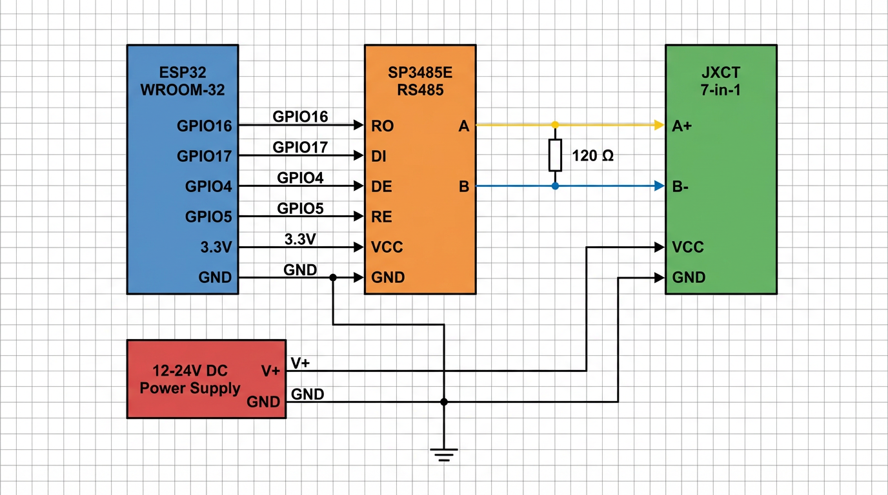
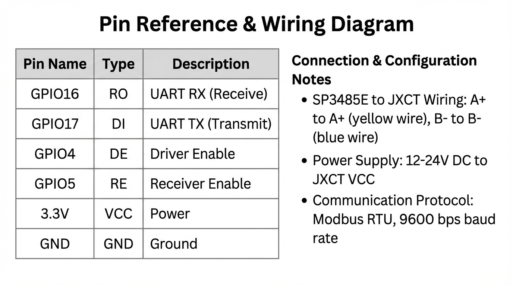

# Схема подключения JXCT 7-в-1

**Дата:** Июль 2025
**Версия:** 3.10.0
**Автор:** JXCT Development Team

---

## 📋 Содержание {#Soderzhanie}

- [Содержание](#Soderzhanie)
- [RS-485 соединение](#rs485-soedinenie)
  - [ESP32  RS-485 Transceiver (SP3485E)](#esp32-rs-485-transceiver-sp3485e)
    - [SP3485E (3.3V логика)](#sp3485e-33v-logika)
    - [Преимущества SP3485E](#Preimushchestva-sp3485e)
  - [Подключение датчика JXCT](#Podklyuchenie-datchika-jxct)
- [Питание датчика](#pitanie-datchika)
  - [Требования к питанию](#Trebovaniya-k-pitaniyu)
  - [Схема подключения питания](#Shema-podklyucheniya-pitaniya)
- [Важные замечания](#vazhnye-zamechaniya)
  - [Критические моменты](#Kriticheskie-momenty)
- [Рекомендации по монтажу](#rekomendacii-po-montazhu)
- [Поддержка](#podderzhka)
  - [Связь с разработчиками](#Svyaz-s-razrabotchikami)
  - [Дополнительные ресурсы](#Dopolnitelnye-resursy)
  - [Полезные ссылки](#Poleznye-ssylki)

---

## 📖 Содержание {#Soderzhanie}

1. **🔌 RS-485 соединение**
2. **⚡ Питание датчика**
3. **⚠️ Важные замечания**
4. **🔧 Рекомендации по монтажу**

---

## 🔌 RS-485 соединение {#rs485-soedinenie}

### ESP32 → RS-485 Transceiver (SP3485E) {#esp32-rs-485-transceiver-sp3485e}

#### SP3485E (3.3V логика) {#sp3485e-33v-logika}
| ESP32 GPIO | SP3485E Pin | Тип сигнала | Описание |
|------------|-------------|-------------|-----------|
| GPIO16     | RO         | Цифровой вход | UART2 RX - прием данных от SP3485E |
| GPIO17     | DI         | Цифровой выход | UART2 TX - передача данных в SP3485E |
| GPIO5      | DE/RE      | Цифровой выход | Управление направлением передачи |
| 3.3V       | VCC        | Питание | Питание модуля SP3485E |
| GND        | GND        | Земля | Общий провод |

#### Преимущества SP3485E: {#Preimushchestva-sp3485e}
- ✅ **Питание от 3.3V** - не требует преобразования уровней
- ✅ **Высокая скорость** - до 10 Mbps
- ✅ **Низкое энергопотребление** - всего 300μA в режиме ожидания
- ✅ **Защита от ESD** - до ±15kV HBM
- ✅ **Встроенная защита** от перенапряжения на линии RS-485

### Подключение датчика JXCT {#Podklyuchenie-datchika-jxct}

| SP3485E Pin | JXCT Pin | Тип сигнала | Описание |
|-------------|----------|-------------|-----------|
| A           | A+       | RS-485 A    | Неинвертирующая линия RS-485 |
| B           | B-       | RS-485 B    | Инвертирующая линия RS-485 |

#### Схемы подключения {#Shemy-podklyucheniya}

## ⚡ Питание датчика {#pitanie-datchika}

### Требования к питанию {#Trebovaniya-k-pitaniyu}
- **SP3485E:** питается от 3.3V ESP32 (оптимально для ESP32)
- **Датчик:** требует отдельное питание 12-24V
- **Общий провод (GND):** соединить все устройства
- **Терминирование:** резистор 120Ω между A и B на концах линии

### Схема подключения питания {#Shema-podklyucheniya-pitaniya}

| Блок питания | JXCT Pin | Описание |
|--------------|----------|-----------|
| V+           | V+       | 12-24V питание датчика |
| GND          | GND      | Общий провод |

## ⚠️ Важные замечания {#vazhnye-zamechaniya}

### Критические моменты {#Kriticheskie-momenty}
- **Полярность:** строго соблюдать подключение A+ и B-
- **Заземление:** обеспечить надежное заземление всех устройств
- **Экранирование:** использовать экранированную витую пару
- **Длина линии:** при длинных линиях использовать терминирующие резисторы

## 🔧 Рекомендации по монтажу {#rekomendacii-po-montazhu}

1. Используйте экранированную витую пару для RS-485
2. Соблюдайте полярность подключения A+ и B-
3. Обеспечьте надежное заземление
4. При длинных линиях используйте терминирующие резисторы

## 📞 Поддержка {#podderzhka}

### 💬 Связь с разработчиками {#Svyaz-s-razrabotchikami}
- **Telegram:** [@Gfermoto](https://t.me/Gfermoto)
- **GitHub Issues:** [Сообщить о проблеме](https://github.com/Gfermoto/soil-sensor-7in1/issues)
- **Документация:** [GitHub Pages](https://gfermoto.github.io/soil-sensor-7in1/)

### 📚 Дополнительные ресурсы {#Dopolnitelnye-resursy}
- [Руководство пользователя](USER_GUIDE.md)
- [Техническая документация](TECHNICAL_DOCS.md)
- [Агрономические рекомендации](AGRO_RECOMMENDATIONS.md)
- [Руководство по компенсации](COMPENSATION_GUIDE.md)
- [API документация](API.md)
- [Управление конфигурацией](CONFIG_MANAGEMENT.md)
- [Протокол Modbus](MODBUS_PROTOCOL.md)
- [Управление версиями](VERSION_MANAGEMENT.md)

### 🔗 Полезные ссылки {#Poleznye-ssylki}

- [🌱 GitHub репозиторий](https://github.com/Gfermoto/soil-sensor-7in1) - Исходный код проекта
- [📋 План рефакторинга](../dev/REFACTORING_PLAN.md) - Планы развития
- [📊 Отчет о техническом долге](../dev/TECHNICAL_DEBT_REPORT.md) - Анализ технических проблем
- [🏗️ Архитектура системы](../dev/ARCH_OVERALL.md) - Общая архитектура проекта
