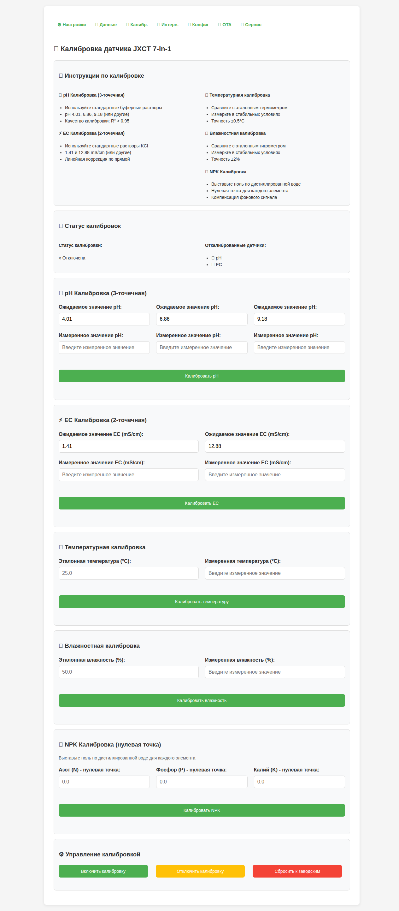

# IoT-датчик почвы 7-в-1 на ESP32: научная компенсация, 24 культуры и open-source прошивка

**Уровень сложности:** Средний  
**Время на прочтение:** 25–30 мин  
**Теги:** IoT, ESP32, точное земледелие, Modbus RTU, RS485, MQTT, Home Assistant

---

## О чём статья

Датчик JXCT 7-в-1 по Modbus RTU даёт сырые значения. Без компенсации температура и влажность сильно искажают EC, pH и NPK. В статье — как устроена open-source прошивка с научно обоснованной компенсацией (Rhoades, Нернст, Delgado), точная схема подключения ESP32 → SP3485E → датчик, интеграции с MQTT, Home Assistant и ThingSpeak, REST API, OTA 2.0, калибровка через CSV, рекомендации по 24 культурам и 13 типам почв.

---

## Что измеряет датчик

| Параметр | Диапазон | Точность |
|----------|----------|----------|
| Температура | -45…115°C | ±0.5°C |
| Влажность | 0–100% | ±3% (0–53%), ±5% (53–100%) |
| EC | 0–10000 µS/cm | ±5% |
| pH | 3–9 | ±0.3 |
| N, P, K | 0–1999 мг/кг | 2% F.S. |

Датчик: Modbus RTU, 9600 bps. Питание датчика: 12–24 В (отдельный блок). ESP32 и SP3485E — от 3.3 В.

---

## Схема подключения (из проекта)

ESP32 общается с датчиком через RS485. Нужен трансивер SP3485E (3.3 V).

**ESP32 → SP3485E:**

```
ESP32 GPIO   │ SP3485E Pin │ Функция
─────────────┼────────────┼──────────────────────────────────
GPIO16       │ RO         │ Receive Output (UART RX)
GPIO17       │ DI         │ Data Input (UART TX)
GPIO4        │ DE         │ Driver Enable
GPIO5        │ RE         │ Receiver Enable
GND          │ GND        │ Общий провод
3.3V         │ VCC        │ Питание SP3485E
```

**SP3485E → JXCT (линия RS485):**

```
SP3485E      │ JXCT       │ Функция
─────────────┼────────────┼─────────────────
A+           │ A+ (жёлт.) │ RS485 Data+
B-           │ B- (син.)  │ RS485 Data-
```

**Питание датчика (отдельное):**

```
Источник 12-24V DC  │ JXCT Pin │ Функция
────────────────────┼──────────┼─────────────────
V+                  │ VCC      │ Питание датчика
GND                 │ GND      │ Общий минус
```

Важно: GND ESP32, SP3485E и блока питания датчика — общий. На длинных линиях RS485 — терминатор 120 Ом между A и B. Полярность A+/B- соблюдать строго.

---

## Научная компенсация

### Двухэтапная схема

1. **SensorCorrection** — всегда включена: множитель + смещение для влажности, EC, температуры.
2. **SensorCompensationService** — научные формулы, включается в настройках.

### EC — Rhoades et al. (1989)

$$\text{EC}_{\text{comp}} = \text{EC}_{\text{raw}} \times (1 + 0.021 \times (T - 25))$$

При +1°C EC растёт примерно на 2.1%. Источник: [Rhoades et al., SSSAJ, 1989](https://doi.org/10.2136/sssaj1989.03615995005300020020x).

### pH — уравнение Нернста (Ross et al., 2008)

$$\text{pH}_{\text{comp}} = \text{pH}_{\text{raw}} - 0.003 \times (T - 25)$$

При +1°C pH снижается на 0.003. Источник: [Ross et al., SSSAJ, 2008](https://doi.org/10.2136/sssaj2007.0088).

### NPK — Delgado et al. (2020)

Учёт температуры и влажности, коэффициенты по типу почвы:

$$\text{N}_{\text{comp}} = \text{N}_{\text{raw}} \times e^{\delta_N(T-20)} \times (1 + \varepsilon_N(\theta-30))$$

Аналогично для P и K. Коэффициенты δ и ε зависят от типа почвы (песок, суглинок, глина, торф и др.). Источник: [Delgado et al., European Journal of Soil Science, 2020](https://doi.org/10.1007/s42729-020-00215-4).

### NutrientInteractionService

Учитывает антагонизмы и синергизмы NPK:

- **Антагонизмы:** N↔K, K↔Mg, P↔Zn, P↔Ca (pH-зависимость).
- **Синергизмы:** N+S, Ca+B.

---

## 24 культуры и 13 типов почв

**CropRecommendationEngine** — рекомендации по 24 культурам.

**Овощи:** томат, огурец, перец, салат, шпинат, капуста, картофель, морковь.  
**Ягоды:** клубника, малина, смородина, черника, ежевика.  
**Плодовые:** яблоня, груша, вишня, виноград.  
**Специальные:** газон, хвойные, базилик, пшеница, соя.  
**Generic** — универсальный профиль.

Для каждой культуры заданы оптимальные диапазоны: температура, влажность, EC, pH, N, P, K.  
Корректировки: сезон (весна/лето/осень/зима), тип среды (открытый грунт, теплица, помещение).

**Типы почв (13):** песок, суглинок, глина, торф, песчано-торфяная смесь, иловая, глинистый суглинок, органическая, песчанистый суглинок, иловатый суглинок, суглинистая глина, засоленная, щелочная.

---

## Калибровка

### Лабораторная (CSV)

Загрузка CSV через веб-интерфейс (`/readings` → загрузка файла). Профили: SAND, LOAM, PEAT. Линейная интерполяция по парам (raw, corrected).

**API калибровки**

- `GET /api/calibration/status` — статус, количество точек.
- `POST /api/calibration/temperature`, `/api/calibration/humidity`, `/api/calibration/ec`, `/api/calibration/ph`, `/api/calibration/npk` — добавление точек.
- `POST /api/calibration/reset` — сброс.
- `GET /api/calibration/export`, `POST /api/calibration/import` — экспорт/импорт.

### Коррекция (множитель + смещение)

- `/api/correction/settings`, `/api/correction/factors` — настройка slope/offset для влажности, EC, температуры.
- `/api/correction/reset` — сброс.

---

## Веб-интерфейс

Встроенный веб-сервер: WiFi/MQTT/ThingSpeak, показания в реальном времени, цветовая индикация (норма / внимание / предупреждение / критично), стрелки изменений после компенсации, AJAX-обновление (по умолчанию каждые 5 с), CSRF-защита.

| Путь | Назначение |
|------|------------|
| `/` | Настройки WiFi, MQTT, ThingSpeak |
| `/readings` | Показания (RAW, компенс., рекомендации), загрузка CSV калибровки |
| `/intervals` | Интервалы опроса, дельта-фильтр |
| `/updates` | OTA обновления |
| `/service` | Диагностика, перезагрузка, сброс |
| `/config_manager` | Импорт/экспорт конфигурации |

Адаптивная вёрстка (mobile/tablet/desktop).

**Скриншоты веб-интерфейса:**





---

## REST API

Версионированный API v1 (см. `include/jxct_strings.h`).

| Метод | Путь | Описание |
|-------|------|----------|
| GET | `/api/v1/sensor` | Данные датчика (JSON) |
| GET | `/api/v1/system/health` | Диагностика |
| GET | `/api/v1/system/status` | Статус сервисов |
| POST | `/api/v1/system/reset` | Сброс настроек |
| POST | `/api/v1/system/reboot` | Перезагрузка |
| GET | `/api/v1/config/export` | Экспорт конфигурации |
| POST | `/api/config/import` | Импорт конфигурации |

Отчёты: `/api/reports/test-summary`, `/api/reports/technical-debt`, `/api/reports/full`.

---

## MQTT

**Топики публикации:** `{prefix}/temperature`, `{prefix}/humidity`, `{prefix}/ec`, `{prefix}/ph`, `{prefix}/nitrogen`, `{prefix}/phosphorus`, `{prefix}/potassium`, `{prefix}/status`.

**Команды:** `jxct/command` — `reboot`, `reset`, `publish_test`.  
`{prefix}/ota/command` — `check`, `install`.

**Интервалы:** 1–60 мин (по умолчанию 30 мин).  
**Дельта-фильтр:** публикация только при значимых изменениях.

---

## Home Assistant

MQTT Discovery включён. Настройте брокер в web UI — датчик появляется в HA автоматически. Топики конфигурации: `homeassistant/sensor/{device_id}_temperature/config` и аналогично для остальных параметров.

---

## ThingSpeak

Поля Field1–7: температура, влажность, EC, pH, N, P, K.  
Интервал: 5–120 мин (по умолчанию 1 мин).  
Валидация: NaN/Inf, диапазоны. Блокировка при серии ошибок, повторные попытки.

---

## OTA 2.0

- **Манифест:** `https://github.com/Gfermoto/soil-sensor-7in1/releases/latest/download/manifest.json`.
- Проверка раз в час (или по команде).
- Двухэтапная схема: проверка → установка через веб.
- SHA256 проверка.
- Локальная загрузка: `/ota/upload` — загрузка `.bin` через веб.
- MQTT: `{prefix}/ota/command` — `check`, `install`.

---

## Дополнительные возможности

- **Дельта-фильтр** — публикация MQTT только при значимых изменениях.
- **Детектор полива** — порог `irrigationSpikeThreshold`, удержание `irrigationHoldMinutes`.
- **Сезонные поправки** — по широте/долготе.
- **NTP** — синхронизация времени.
- **Фильтры** — Калман, медиана, outlier.
- **Watchdog** — 30 с (60 с при OTA).
- **Кнопка сброса** — удержание 5 с.
- **Тесты** — pytest, native unit tests, ~70% покрытие.
- **CI/CD** — GitHub Actions.

---

## Архитектура

```
Modbus RTU (9600)
       ↓
modbus_sensor → SensorData (raw)
       ↓
SensorCorrection (slope/offset)
       ↓
CalibrationManager (CSV таблицы)
       ↓
SensorCompensationService (Rhoades, Nernst, Delgado)
       ↓
NutrientInteractionService (NPK антагонизм/синергизм)
       ↓
AdvancedFilters (Калман, медиана, outlier)
       ↓
CropRecommendationEngine (рекомендации)
       ↓
┌──────────────────────────────────────────────────┐
│  Веб-интерфейс  │  REST API  │  MQTT  │ ThingSpeak │
└──────────────────────────────────────────────────┘
```

---

## Быстрый старт

```bash
git clone https://github.com/Gfermoto/soil-sensor-7in1.git
cd soil-sensor-7in1
pip install -r requirements.txt
pio run -t upload
pio run -t uploadfs
```

После загрузки — точка доступа ESP32, настройка WiFi, веб по `http://<IP>`.

---

## Стек

C++17, PlatformIO, Arduino, Modbus RTU (9600), CSRF, 90+ тестов, AGPL-3.0.

Репозиторий: [github.com/Gfermoto/soil-sensor-7in1](https://github.com/Gfermoto/soil-sensor-7in1)  
Документация: [gfermoto.github.io/soil-sensor-7in1](https://gfermoto.github.io/soil-sensor-7in1)

---

*Вопросы — в комментариях или Issues на GitHub.*
